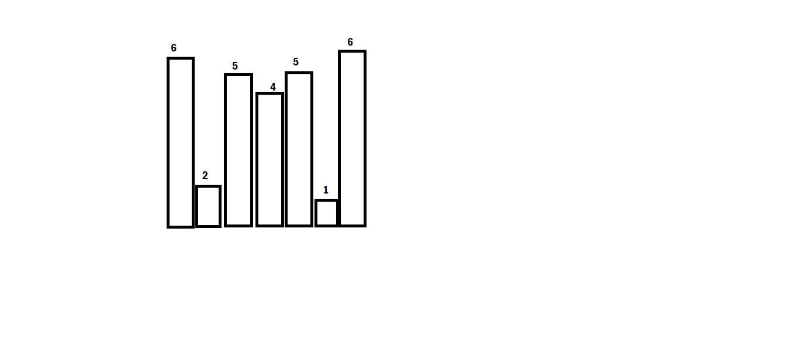

# STACKS

## CONTENT
- [Stacks Introduction](#stacks-introduction)
- [Nearest Greatest Element to right](#nearest-greatest-element-to-right)
- [Nearest Greatest Element to left](#nearest-greatest-element-to-left)
- [Nearest Smallest Element to right](#nearest-smallest-element-to-right)
- [Nearest Smallest Element to left](#nearest-smallest-element-to-left)
- [Stock Span Problem](#stock-span-problem)
- [Maximum Area of Histogram](#maximum-area-of-histogram)
- [Maximum Area Rectangle in Binary Matrix](#maximum-area-rectangle-in-binary-matrix)
---
### **Stacks Introduction**
Stack is a dara structure with the property of Last in First Out(LIFO). The concept of stack is generally applied in questions where when we apply the brute force we will get the result in O(n^2).

And when we are applying this brute force method with loops the inner loop will be dependent on the variable of the outer loop.

This way we can guess that 99% of the time it is a stack problem.

[^Top](#content)

---

### **Nearest Greatest Element to Right**
The concept is very simple. In these problems we are given an array and in that array we need to find the greatest element to te right of each element.

Lets take an example

```
0   1   2   3   4   5   6   7   8
3   2   9   4   5   3   1   2   56
```

We are given the above array. For this above array we have to find the greatest element to right for each element and if not present we print '-1'

So solution for the above array will be

```
0   1   2   3   4   5   6   7   8
9   9   56  5   56  56  2   56  -1
```

Now if we apply the brute force the approach will be :-

```C#
for(int i=0;i<arr.Length;i++){
    for(j=i+1;j<arr.Length;j++){
        // check for maximum element than than the arr[i] element and store in list
    }
}
```

As we can see in the above approach the inner loop is dependent on the outer loop so we take help of stack

Our approach will be :-

1. Since we want the greater element to the right so techniquely if we remove the element against whic we are looking for the greatest element, we are seraching in a new array to the right.
```
0   1   2   3   4   5   6   7   8
3   2   9   4   5   3   1   2   56
```
In this array if we are looking for greatest element for '3' we are basically looking at an array as
```
0   1   2   3   4   5   6   7 
2   9   4   5   3   1   2   56
```
This is the new array we got.

2. So here what we do is we traverse from the extreme end searching for maximum element for the rightmost element first. In this case 56.
3. As we know for rightmost element we will never have a maximum element we simply push the element in a stack.

```
Stack : [56]
ResultList : [-1,]
```
We have to return -1 if maximum is not possible

4. Now we traverse back in loop and we find '2'. We compare it with the top element in stack.On comparison we have two conditions:-
    
    - The top element will be greater than the element.
    - The top element will be smaller than the element.

5. If the top element is greater than the element than we add that element in the result list and push this element in the stack making it the top element.

Like in the above example case 56 > 2 so we add 56 to the list and we push 2 in stack.
 ```
Stack : [56,2]
ResultList : [-1,56]
```
6. If the top element is smaller than in that case we pop that element from the stack until the stack becomes empty or we find a greater element.

7. If on doing 6th step the stack becomes empty we add -1 to the list and if we find the greater element we insert that to list.

Solving for the array :-

1. Now for this array 
```
0   1   2   3   4   5   6   7 
2   9   4   5   3   1   2   56
```
 ```
Stack : [56,2]
ResultList : [-1,56]
```
2. After 2 we have 1 and 2>1 so we will get 2 in result list and 1 in stack.

```
Stack : [56,2,1]
ResultList : [-1,56,2]
```
3. After '1' we have 3. Now 1 and 2 both are not greater than 3 so we pop both. We find 56 which is greater so we add '3' to stack and 56 to list

```
Stack : [56,3]
ResultList : [-1,56,2,56]
```
> A very important point to note here. One can see that we have poped out 1 and 2 from stack as they will never be required for further checking because we already got a number(3) which is near and greater than both. This reduces space complexity and also we don't have to loop twice.

4. Similarly following the steps and doing for rest of the array we will get
```
Stack : [56,9]
ResultList : [-1,56,2,56,56,5,56,9,9]
```

Now the above result list is not the actual answer. We have to reverse this list and we will get our desired result.

```C#
public List<int> NearestGreaterElementRight(int[] arr,int n){
    List<int> li = new List<int>();
    Stack<int> st = new Stack<int>();
    for(int i=n-1;i>=0;i--){
        if(st.Count==0){
            li.Add(-1);
        }
        else if(st.Count>0 && st.Peek()>arr[i]){
           li.Add(st.Peek()); 
        }
        else if(st.Count>0 && st.Peek()<=arr[i]){
            while(st.Count>0 && st.Peek()<=arr[i]){
                st.Pop();
            }
            if(st.Count==0){
                li.Add(-1);
            }
            else if(st.Peek()>arr[i]){
                li.Add(st.Peek());
            }
        }
        st.Push(arr[i]);
    }
    return li;
}
```
[^Top](#content)

---
### **Nearest Greatest Element to Left**
In this problem we need to find the greatest element to the left side and not the right side. So the approach remains the same just in this problem we will traverse from begining and not the end.

```C#
public List<int> NearestGreaterElementLeft(int[] arr,int n){
    List<int> li = new List<int>();
    Stack<int> st = new Stack<int>();
    for(int i=0;i<n;i++){
        if(st.Count==0){
            li.Add(-1);
        }
        else if(st.Count>0 && st.Peek()>arr[i]){
           li.Add(st.Peek()); 
        }
        else if(st.Count>0 && st.Peek()<=arr[i]){
            while(st.Count>0 && st.Peek()<=arr[i]){
                st.Pop();
            }
            if(st.Count==0){
                li.Add(-1);
            }
            else if(st.Peek()>arr[i]){
                li.Add(st.Peek());
            }
        }
        st.Push(arr[i]);
    }
    return li;
}
```


[^Top](#content)

---
### **Nearest Smallest Element to Right**
In this problem we need to find the smallest element to the right side. The approach for the smallest element is similar to greatest element to right just the condition of greater than and less than changes as we are looking for smaller element.

```C#
public List<int> NearestSmallerElementLeft(int[] arr,int n){
    List<int> li = new List<int>();
    Stack<int> st = new Stack<int>();
    for(int i=n-1;i>=0;i--){
        if(st.Count==0){
            li.Add(-1);
        }
        else if(st.Count>0 && st.Peek()<arr[i]){
           li.Add(st.Peek()); 
        }
        else if(st.Count>0 && st.Peek()>=arr[i]){
            while(st.Count>0 && st.Peek()>=arr[i]){
                st.Pop();
            }
            if(st.Count==0){
                li.Add(-1);
            }
            else if(st.Peek()<arr[i]){
                li.Add(st.Peek());
            }
        }
        st.Push(arr[i]);
    }
    return li;
}
```
[^Top](#content)

---
### **Nearest Smallest Element to Left**
In this problem we need to find the smallest element to the left side. The approach for the smallest element is similar to greatest element to left just the condition of greater than and less than changes as we are looking for smaller element.

```C#
public List<int> NearestSmallerElementLeft(int[] arr,int n){
    List<int> li = new List<int>();
    Stack<int> st = new Stack<int>();
    for(int i=0;i<n;i++){
        if(st.Count==0){
            li.Add(-1);
        }
        else if(st.Count>0 && st.Peek()<arr[i]){
           li.Add(st.Peek()); 
        }
        else if(st.Count>0 && st.Peek()>=arr[i]){
            while(st.Count>0 && st.Peek()>=arr[i]){
                st.Pop();
            }
            if(st.Count==0){
                li.Add(-1);
            }
            else if(st.Peek()<arr[i]){
                li.Add(st.Peek());
            }
        }
        st.Push(arr[i]);
    }
    return li;
}
```
[^Top](#content)

---
### **Stock Span Problem**
The above problem states that, given an array depicting stock prices each day, your job is to find consecutive smaller or equal  stock prices to a given stock price before that day.(Need to include the element also)

Example

```
0   1   2   3   4   5   6 
100 80  60  70  60  75  85
```
Now here we are given stock prices for each day and need to find consecutive smaller to a given element before that day.


```
0   1   2   3   4   5   6 
100 80  60  70  60  75  85

Answer

0   1   2   3   4   5   6 
1   1   1   2   1   4   6

```

Now in the above example for 100 we have only 100(as we need to include the element also), so answer is 1, similarly for 80 and 60. For 70 60<70 so we have 2, and same way for others.

If we closely observe the above problem can be treated as Nearest Greatest Number to Left because as soon as we encounter a greater number we are breaking the loop and taking count till that number.

If we closely in this example  
```
0   1   2   3   4   5   6 
100 80  60  70  60  75  85
```
whenever we are encountering a greater number to left we are breaking the count of consecutive number.

So lets find the nearest greatest number to left.

```
0   1   2   3   4   5   6 
100 80  60  70  60  75  85

0   1   2   3   4   5   6
-1  100 80  80  70  80  100
```

But as we know we need to find the count here and not the value, So in order to achieve that we want the indexes of these greatest number for each element.


```
0   1   2   3   4   5   6 
100 80  60  70  60  75  85

0   1   2   3   4   5   6
-1  0   1   1   3   1   0
```

Now if we closely observe the answer to our solution is the last array we found but with a slight change of :-

```C#
answer[i] = thisarray[i]-i;
```
So here are the changes for the code :-

1. We will store array indexes in the stack and while checking with the elements we will use these indexes.
2. Then after return these indexes we will make this array changed again by subtracting its value with its index.

```C#
public List<int> StockExchangeProblem(int[] arr,int n){
    List<int> li = new List<int>();
            Stack<int> st = new Stack<int>();
            for (int i = 0; i < n; i++)
            {
                if (st.Count == 0)
                {
                    li.Add(-1);
                }
                else if(st.Count>0 && arr[st.Peek()] > arr[i])
                {
                    li.Add(st.Peek());
                }
                else if(st.Count > 0 && arr[st.Peek()] <= arr[i])
                {
                    while(st.Count > 0 && arr[st.Peek()] <= arr[i])
                    {
                        st.Pop();
                    }
                    if (st.Count == 0)
                    {
                        li.Add(-1);
                    }
                    else if(arr[st.Peek()] > arr[i])
                    {
                        li.Add(st.Peek());
                    }
                }
                st.Push(i);
}

```
[^Top](#content)

---
### **Maximum Area of Histogram**
The next problem we have is maximum area of histogram.

Problem Statement :- It says that given an array of various values(let the values be height of buildings). What we need to find is the maximum area of the buildings combined and the condition is that area needs to be regular figure.

Explaining in simple words 
```
6, 2, 5, 4, 5, 1, 6
```
Suppose we have these buildings of these heights.



Now as we can see that for 6 we can have area only of 6 as after 6 we have height of 2. Similarly for 2 we will have till 1 so width becomes 4 and value becomes 2.

Similarly for others.

Now in such an array we need to find the maximum area.
The simplest logic as we can see is we need to find Nearest Smallest To Left and Nearest Smallest To Right.


Make there count and then find the width 

Multiply it by value and we will have an array for all heights with the given areas.

Then in that array find the maximum value.

The code for the above is :-
```C#
public int MaxArray(List<int> left,List<int> right,int[] arr,int n){
    int max=0;
    int[] result = new int[n];
    for(int i=0;i<n;i++){
        result[i] = (right[i]-left[i]-1)*arr[i];
    }
    for(int i=0;i<n;i++){
        if(result[i]>max)
        max=result[i];
    }
    return max;
}

public List<int> IndexNSR(int[] arr,int n){
    int pseudoindex = n;
    List<int> li = new List<int>();
    Stack<int> st = new Stack<int>();
    for(int i=n-1;i>=0;i--){
        if(st.Count==0){
            li.Add(pseudoindex);
        }
        else if(st.Count>0 && arr[st.Peek()]<arr[i]){
            li.Add(st.Peek());
        }
        else if(st.Count>0 && arr[st.Peek()]>=arr[i]){
            while(st.Count>0 && arr[st.Peek()]>=arr[i]){
                st.Pop();
            }
            if(st.Count==0){
                li.Add(pseudoindex);
            }
            else if(arr[st.Peek()]<arr[i]){
                li.Add(st.Peek());
            }
        }
        st.Push(i);
    }
    li.Reverse();
    return li;
}
public List<int> IndexNSL(int[]arr,int n){
    int pseudoindex=-1;
    Stack<int> st = new Stack<int>();
    List<int> li = new List<int>();
    for(int i=0;i<n;i++){
        if(st.Count==0){
            li.Add(pseudoIndex);
        }
        else if(st.Count>0 && arr[st.Peek()]<arr[i]){
            li.Add(st.Peek());
        }
        else if(st.Count>0 && arr[st.Peek()]>=arr[i]){
            while(st.Count>0 && arr[st.Peek()]>=arr[i]){
                st.Pop();
            }
            if(st.Count==0){
                li.Add(pseudoindex);
            }
            else if(arr[st.Peek()]<arr[i]){
                li.Add(st.Peek());
            }
        }
        st.Push(i);
    }
    return li;
}
```
> The max returned from the method will be our answer that we require.

[^Top](#content)

---

### **Maximum Area Rectangle in Binary Matrix**
This question is just a follow up of the maximum area of histogram problem.
In this question we are given a matrix(2d array) and in that we need to find the maximum area that can be produced.

```
    0   1   2   3
 0  0   1   1   0
 1  1   1   1   1
 2  1   1   1   1
 3  1   0   0   1
```
Now in this binary matrix we want the max area. As we can see that the area max will be 8.
**From arr[0,1] to arr[2,3]**

How to approach the problem :-

1. As we already know how to get area for 1-d array(Maximum area Histogram problem) we will break this into that problem and solve.

2. Now if we closely look the first row we have 0 1 1 0

3. We can assume it as the first list of building whose max height we want

4. Here we will get 2 as answer.
5. Now we go down the second row. Here there are 2 important points.
    - First the heights of the building here will be sum of previous row + this row and we will store them. We do this because then for the third row we just need to add the values in the 3rd row and we get the new values each time.
    - Secondly if we encounter any zero after the first row we will make the whole height of the building as 0 for further calculations. This is done because when we encounter 0 we can't go past it in further rows.

6. Then for each case we apply MAH and we will get maximum value each time.
7. We compare it with the maximum value of the previous rows and then atlast print the maximum value.

Code for the above is as follows :-
```C#
public int BinaryMatrixMaxArea(int[,] binaryMatrix,int n,int m){
    List<int> hn = new List<int>();
    int max=-1;
    for(int i=0;i<m;i++){
        hn.Add(binaryMatrix[0,m]);
    }
    max = MaximumAreaHistogram(hn.ToArray(),hn.ToArray().Length);

    for(int i=1;i<n;i++){
        for(int j=0;j<m;j++){
            if(binaryMatrix[i,j]==0){
                hn[j]==0;
            }
            else{
                hn[j] = hn[j] + binaryMatrix[i,j];
            }
        }
        max = (max,MaximumAreaHistogram(hn.ToArray(),hn.ToArray().Length));
    }
    Console.WriteLine(max);
}

public int MaximumAreaHistogram(int[] arr,int n){
    int[] result = new int[n];
    int max = -1;
    List<int> left = nearestSmallestLeft(arr,n);
    List<int> right = nearestSmallestRight(arr,n);
    for(int i=0;i<n;i++){
        result[i] = (right[i]-left[i]-1)*arr[i];
    }
    max = MaxinArray(result,n);
    return max;
}

public List<int> nearestSmallestLeft(int[] arr,int n){
    List<int> li = new List<int>();
    Stack<int> st = new Stack<int>();
    int pseudoIndex = -1;
    for(int i=0;i<n;i++){
        if(st.Count==0){
            li.Add(pseudoIndex);
        }
        else if(st.Count>0 && arr[st.Peek()]<arr[i]){
            li.Add(st.Peek());
        }
        else if(st.Count>0 && arr[st.Peek()]>=arr[i]){
            while(st.Count>0 && arr[st.Peek()]>=arr[i]){
                st.Pop();
            }
            if(st.Count==0){
                li.Add(pseudoIndex);
            }
            else if(arr[st.Peek()]<arr[i]){
                li.Add(st.Peek());
            }
        }
        st.Push(i);
    }
}

public List<int> nearestSmallestRight(int[] arr,int n){
    List<int> li = new List<int>();
    Stack<int> st = new Stack<int>();
    int pseudoIndex = n;
    for(int i=n-1;i>=0;i--){
        if(st.Count==0){
            li.Add(pseudoIndex);
        }
        else if(st.Count>0 && arr[st.Peek()]<arr[i]){
            li.Add(st.Peek());
        }
        else if(st.Count>0 && arr[st.Peek()]>=arr[i]){
            while(st.Count>0 && arr[st.Peek()]>=arr[i]){
                st.Pop();
            }
            if(st.Count==0){
                li.Add(pseudoIndex);
            }
            else if(arr[st.Peek()]<arr[i]){
                li.Add(st.Peek());
            }
        }
        st.Push(i);
    }
}

public int MaxinArray(int[] arr,int n){
    int max=0;
    for(int i=0;i<n;i++){
        if(arr[i]>max)
        max=arr[i];
    }
    return max;
}

public int MaxOfTwoNumbers(int a,int b){
    if(a>b)
        return a;
    return b;
}
```
[^Top](#content)

---

